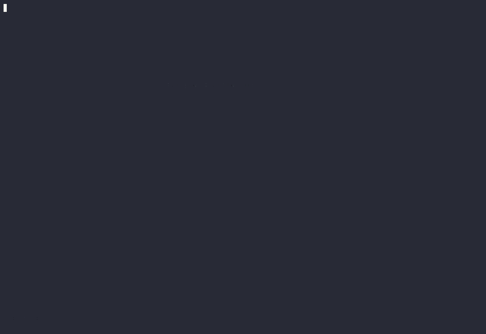

# 🐛 autodap.nvim

Zero-config debugging for Neovim. A thin layer over
[nvim-dap](https://github.com/mfussenegger/nvim-dap) that reads your project and
wires up the debugger for you — no `launch.json`, no per-language boilerplate.
Press your debug key and pick a target.


Open a file, set a breakpoint, press `<F5>`, pick a target. Nothing language-specific is
typed — the same three keys do the same thing in every project below.

<details>
<summary><b>C++ (CMake), a lone <code>.c</code> file, and Node</b></summary>

<br>

**C++** — executable discovered from the CMake build directory:



**A lone `.c` file** — no build system, no git repo; compiled with `-g` on launch:


**Node** — npm scripts discovered alongside the current file:


</details>

`nvim-dap` is powerful but ships **no** configuration per language: you write the
adapter and the launch config yourself, for every project. autodap fills that gap
by detecting the project from the files already in it and generating the adapter
and configurations on the fly.

## ✨ Features

- **Zero config** — open a file in a supported project and press your debug key.
- **Composes, never clobbers** — registers as an nvim-dap config _provider_, so it
  merges with your `launch.json` and hand-written configs instead of overwriting.
- **Monorepo-aware** — roots resolve to the nearest workspace member; scripts,
  `tsx`/`ts-node` and virtualenvs resolve through hoisted layouts.
- **Works on loose files too** — the project support is additive; a lone `.js`,
  `.py`, or `.c` with no project still gets a launch config.
- **Lazy adapter install** — missing adapters are fetched via
  [mason](https://github.com/williamboman/mason.nvim) on first use (optional).

| Language | Adapter | Discovered automatically |
| --- | --- | --- |
| Node / JS / TS | `js-debug-adapter` | every script in the nearest `package.json`; launch current file (uses local `tsx`/`ts-node` for TS); attach to a process |
| Python | `debugpy` | launch current file (with/without args); interpreter from `VIRTUAL_ENV` or the nearest `.venv` walking up; attach on `127.0.0.1:5678` |
| C / C++ | `codelldb` | executable targets from the CMake File API (bounded scan fallback); **auto-compiles a lone `.c`/`.cpp` with `-g`** when there is no build system |

## ⚡️ Requirements

- Neovim >= 0.10
- [nvim-dap](https://github.com/mfussenegger/nvim-dap)
- [mason.nvim](https://github.com/williamboman/mason.nvim) — optional, for
  automatic adapter installation. Without it, autodap uses adapters already on
  your `PATH`.

## 📦 Installation

With [lazy.nvim](https://github.com/folke/lazy.nvim):

```lua
{
  'JarnDev/autodap.nvim',
  dependencies = {
    'mfussenegger/nvim-dap',
    'williamboman/mason.nvim', -- optional
  },
  config = function()
    require('autodap').setup()
    -- Map your debug key to the friendly entrypoint:
    vim.keymap.set('n', '<F5>', function() require('autodap').continue() end)
  end,
}
```

Open a file in a supported project, press `<F5>`, pick a target. That's it.

## ⚙️ Configuration

`setup()` works with no arguments. These are the defaults:

```lua
require('autodap').setup({
  -- Lazy / on-demand install: the adapter for a language is fetched via mason the
  -- first time you debug that language, not at startup (mirrors mason-lspconfig's
  -- `automatic_installation`). Set false to only ever use adapters on your PATH.
  auto_install = true,

  -- Languages to handle. Drop one to leave its filetypes entirely to your own config.
  languages = { 'node', 'python', 'cpp' },

  cpp = {
    adapter = 'codelldb',
    -- Directories scanned for prebuilt executables (globs allowed).
    build_dirs = { 'build', 'cmake-build-*', 'out/build/*', 'builddir', 'out' },
    -- Compile a lone .c/.cpp with -g when there is no build system to find a
    -- binary in. Set false to be prompted for an executable path instead.
    auto_compile = true,
    compile_flags = { '-g', '-O0' },
  },
})
```

## 🚀 Usage

Map your debug key to `require('autodap').continue()` and use it as you would
`dap.continue()`. It does one extra thing on a fresh machine: it checks the
adapter is installed _before_ starting and kicks off the mason install with a
notification, instead of letting nvim-dap throw a stack trace on a missing
binary. Run it again once the install finishes.

A plain `require('dap').continue()` from your existing keymaps also works — the
generated configs come through the provider — it just skips that install guard.

### Simple files, not just workspaces

The large-project support is **additive**: it never gates basic debugging. Open a
loose `.js` or `.py` with no `package.json`, no virtualenv, not even a git repo,
and you still get a **Launch current file** config; the root falls back to the
file's own directory. A project only _adds_ targets (npm scripts, CMake
executables) on top.

**C/C++** works too — a native debugger can't run a `.c` directly, so when there
is no build system autodap compiles the current file with `-g` and debugs the
result, recompiling on each launch so edits are always picked up.

### Commands

- `:AutodapContinue` — same as `require('autodap').continue()`.
- `:AutodapReset` — forget the remembered C/C++ executable for the current project.

## ⚠️ Known limitations

- Adapter auto-install is **asynchronous**: the first `<F5>` on a fresh machine
  starts the download and asks you to run again once it lands. It does not block
  and auto-continue (yet — see roadmap).
- C/C++ target discovery uses the CMake File API when available and a bounded
  filesystem scan otherwise. It auto-compiles a _single_ file, but does not build
  a multi-file project — point it at your build system's output.
- No debug-test integration (jest/vitest/pytest) and no Rust/Go yet.

## 🗺️ Roadmap

- Debug the test under the cursor (jest / vitest / pytest).
- Auto-continue after a mason install finishes (`pkg:once('install:success')`).
- Rust (codelldb) and Go (delve).
- Optional CMake File API query bootstrap when no reply exists yet.

## 🧪 Tests

Config generation and target discovery are exercised headless against fixture
projects (a node monorepo, python venvs, CMake projects with and without a File
API reply, and single-file compilation):

```sh
make test
```

The first run clones `nvim-dap` into `tests/.deps/` so the tests hit the real
provider and adapter API.

## 🙏 Acknowledgements

Built entirely on [nvim-dap](https://github.com/mfussenegger/nvim-dap) and
[mason.nvim](https://github.com/williamboman/mason.nvim).
[mason-nvim-dap](https://github.com/jay-babu/mason-nvim-dap.nvim) is a great
companion — it installs debug adapters; autodap generates the configurations you
would otherwise write by hand.

## 📄 License

[MIT](./LICENSE)
