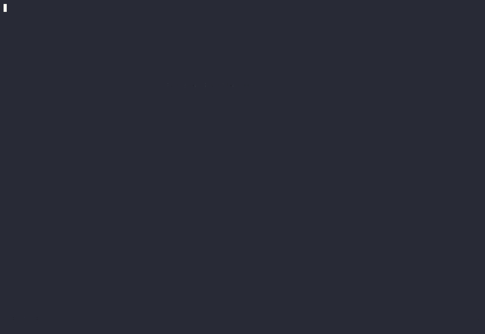

# 🐛 autodap.nvim

[](https://github.com/JarnDev/autodap.nvim/actions/workflows/ci.yml)

Zero-config debugging for Neovim. A thin layer over
[nvim-dap](https://github.com/mfussenegger/nvim-dap) that reads your project and
wires up the debugger for you — no `launch.json`, no per-language boilerplate.
Press your debug key and pick a target.

> What a per-language debug plugin does for one language, autodap orchestrates
> for all of them — automatically, from your project.


Open a file, set a breakpoint, press `<F5>`, pick a target. Nothing language-specific is
typed — the same three keys do the same thing in every project below.

<details>
<summary><b>C++ (CMake), a lone <code>.c</code> file, and Node</b></summary>

<br>

**C++** — executable discovered from the CMake build directory:



**A lone `.c` file** — no build system, no git repo; compiled with `-g` on launch:


**Node** — npm scripts discovered alongside the current file:


</details>

`nvim-dap` is powerful but ships **no** configuration per language: you write the
adapter and the launch config yourself, for every project. autodap fills that gap
by detecting the project from the files already in it and generating the adapter
and configurations on the fly.

## ✨ Features

- **Zero config** — open a file in a supported project and press your debug key.
- **Composes, never clobbers** — registers as an nvim-dap config _provider_, so it
  merges with your `launch.json` and hand-written configs instead of overwriting.
- **Monorepo-aware** — roots resolve to the nearest workspace member; scripts,
  `tsx`/`ts-node` and virtualenvs resolve through hoisted layouts.
- **Works on loose files too** — the project support is additive; a lone `.js`,
  `.py`, or `.c` with no project still gets a launch config.
- **Debug the test under the cursor** — jest, vitest, and pytest; the test you
  are in is resolved with Treesitter (nested suites, decorators, parametrised
  titles) and run in the debugger, with a regex fallback when no parser is
  installed.
- **Lazy adapter install** — missing adapters are fetched via
  [mason](https://github.com/williamboman/mason.nvim) on first use (optional).
- **UI opens itself** — if [nvim-dap-ui](https://github.com/rcarriga/nvim-dap-ui)
  is installed, it opens when a session starts, so your debug key is all you
  press. It stays open after the program exits so you can inspect the final
  state (optional; set `ui = false` to manage it yourself).

| Language | Adapter | Discovered automatically |
| --- | --- | --- |
| Node / JS / TS | `js-debug-adapter` | every script in the nearest `package.json`; launch current file (uses local `tsx`/`ts-node` for TS); attach to a process |
| Python | `debugpy` | launch current file (with/without args); interpreter from `VIRTUAL_ENV` or the nearest `.venv` walking up; attach on `127.0.0.1:5678` |
| C / C++ | `codelldb` | executable targets from the CMake File API (bounded scan fallback); **auto-compiles a lone `.c`/`.cpp` with `-g`** when there is no build system |

## ⚡️ Requirements

- Neovim >= 0.10
- [nvim-dap](https://github.com/mfussenegger/nvim-dap)
- [mason.nvim](https://github.com/williamboman/mason.nvim) — optional, for
  automatic adapter installation. Without it, autodap uses adapters already on
  your `PATH`.
- [nvim-dap-ui](https://github.com/rcarriga/nvim-dap-ui) — optional. When
  present, autodap opens it on session start (and leaves it open afterwards).
  You still configure (and `require('dapui').setup()`) it yourself.

## 📦 Installation

With [lazy.nvim](https://github.com/folke/lazy.nvim):

```lua
{
  'JarnDev/autodap.nvim',
  dependencies = {
    'mfussenegger/nvim-dap',
    'williamboman/mason.nvim', -- optional
  },
  config = function()
    require('autodap').setup()
    -- Map your debug key to the friendly entrypoint:
    vim.keymap.set('n', '<F5>', function() require('autodap').continue() end)
  end,
}
```

Open a file in a supported project, press `<F5>`, pick a target. That's it.

## ⚙️ Configuration

`setup()` works with no arguments. These are the defaults:

```lua
require('autodap').setup({
  -- Lazy / on-demand install: the adapter for a language is fetched via mason the
  -- first time you debug that language, not at startup (mirrors mason-lspconfig's
  -- `automatic_installation`). Set false to only ever use adapters on your PATH.
  auto_install = true,

  -- Open nvim-dap-ui automatically when a session starts, if it is installed
  -- (it stays open after the program exits, for inspection). 'auto' = do it when
  -- present; false = never touch the UI (you open/close it yourself). autodap
  -- never calls dapui.setup() for you — that configuration stays yours.
  ui = 'auto',

  -- Languages to handle. Drop one to leave its filetypes entirely to your own config.
  languages = { 'node', 'python', 'cpp' },

  python = {
    -- 'auto' resolves the interpreter from $VIRTUAL_ENV, then the nearest
    -- .venv / venv / env walking up. Set a venv directory or an interpreter
    -- path to pin it instead.
    venv = 'auto',
  },

  cpp = {
    adapter = 'codelldb',
    -- Directories scanned for prebuilt executables (globs allowed).
    build_dirs = { 'build', 'cmake-build-*', 'out/build/*', 'builddir', 'out' },
    -- Compile a lone .c/.cpp with -g when there is no build system to find a
    -- binary in. Set false to be prompted for an executable path instead.
    auto_compile = true,
    compile_flags = { '-g', '-O0' },
  },

  -- Extra CLI args appended to the "debug the test under the cursor" command,
  -- per framework. Escape hatch for version-specific flags — e.g. vitest may
  -- need { '--no-file-parallelism' } (or an older single-thread flag) for
  -- breakpoints to bind reliably.
  test = {
    extra_args = { jest = {}, vitest = {}, pytest = {} },
  },
})
```

## 🚀 Usage

Map your debug key to `require('autodap').continue()` and use it as you would
`dap.continue()`. It does one extra thing on a fresh machine: it checks the
adapter is installed _before_ starting and kicks off the mason install with a
notification, instead of letting nvim-dap throw a stack trace on a missing
binary. Run it again once the install finishes. With `auto_install = false` (or
no mason) it tells you the package to install by hand instead, and if you
registered the adapter yourself it stays out of the way entirely.

A plain `require('dap').continue()` from your existing keymaps also works — the
generated configs come through the provider — it just skips that install guard.

### Simple files, not just workspaces

The large-project support is **additive**: it never gates basic debugging. Open a
loose `.js` or `.py` with no `package.json`, no virtualenv, not even a git repo,
and you still get a **Launch current file** config; the root falls back to the
file's own directory. A project only _adds_ targets (npm scripts, CMake
executables) on top.

**C/C++** works too — a native debugger can't run a `.c` directly, so when there
is no build system autodap compiles the current file with `-g` and debugs the
result, recompiling on each launch so edits are always picked up.

### Debug the test under the cursor

Put the cursor in a test and run it in the debugger — jest, vitest, or pytest,
detected from the project:

```lua
vim.keymap.set('n', '<leader>dt', function() require('autodap').debug_test() end)
```

It finds the innermost test the cursor is actually *inside* and launches just
that one. The same entry also shows up at the top of the `<F5>` picker when
you're in a test file. If breakpoints don't bind on a given framework version,
add flags via `test.extra_args`.

Resolution is Treesitter-based where a parser for the buffer's language is
installed, which is what makes the awkward cases come out right:

- nested `describe`s contribute to the `-t` pattern, so a test title that
  appears in two suites still runs only the one you are in;
- a cursor on a `@pytest.mark.parametrize` decorator resolves to the test it
  decorates, not to whatever came before it;
- nested `class Test*` produce the full `Outer::Inner::test_x` node id;
- a `def` nested inside a test is not mistaken for a test of its own;
- parametrised titles (`` it.each ``'s `%s`/`$column`, and `${}` in template
  literals) become wildcards in the pattern, so every row matches instead of
  none.

Treesitter is **not** a dependency. With no parser installed, autodap falls back
to the line-based regex scanner it has always used — `it`/`test`/`describe` for
JS, `def test_*` and its enclosing `class` for pytest. `:checkhealth autodap`
says which of the two your buffer gets.

### Commands

- `:AutodapContinue` — same as `require('autodap').continue()`.
- `:AutodapTest` — debug the test under the cursor.
- `:AutodapReset` — forget the remembered C/C++ executable for the current project.

## ⚠️ Known limitations

- Adapter auto-install is **asynchronous**: the first `<F5>` on a fresh machine
  starts the download and asks you to run again once it lands. It does not block
  and auto-continue (yet — see roadmap).
- C/C++ target discovery uses the CMake File API when available and a bounded
  filesystem scan otherwise. It auto-compiles a _single_ file, but does not build
  a multi-file project — point it at your build system's output.
- Test-under-cursor for JS is version-sensitive (jest uses `--runInBand`; vitest
  breakpoints may need a single-thread flag depending on the version) — use
  `test.extra_args` to tune.
- Nearest-test detection uses Treesitter where a parser is installed and a
  line-based regex scanner otherwise; the fallback cannot see nesting,
  decorators, or parametrised titles. `:checkhealth autodap` reports which one
  your buffer is getting.
- No Rust/Go yet.

## 🗺️ Roadmap

- Auto-continue after a mason install finishes (`pkg:once('install:success')`).
- Rust (codelldb) and Go (delve).
- Optional CMake File API query bootstrap when no reply exists yet.

## 🧪 Tests

Config generation and target discovery are exercised headless against fixture
projects (a node monorepo, python venvs, CMake projects with and without a File
API reply, and single-file compilation):

```sh
make test
```

The first run clones `nvim-dap` into `tests/.deps/` so the tests hit the real
provider and adapter API, and builds pinned Treesitter parsers for Python,
JavaScript and TypeScript there with your C compiler, so the nearest-test cases
run against real parse trees. With no compiler (or no network) those cases
report themselves as skipped and the regex fallback is covered instead; CI sets
`AUTODAP_REQUIRE_TREESITTER=1`, which turns that skip into a failure so the
Treesitter path cannot silently stop being tested.

A second suite debugs for real — it builds a throwaway Neovim config containing
nothing but nvim-dap and autodap, installs them the way the install section
above tells you to, then sets a breakpoint in a sample Python, Node and C/C++
project, launches debugpy, js-debug and codelldb, reads a local out of each
stopped frame and runs each to completion:

```sh
make test-e2e
```

Your own config and plugins are never touched — everything the suite builds
lives in a temporary directory, with one exception: codelldb is a ~55 MB
download, so it is cached in `${XDG_CACHE_HOME:-~/.cache}/autodap-e2e` and
reused by later runs. Delete that directory to force a re-download. A language
whose toolchain is missing is skipped with a printed reason rather than failing.
The suite runs in CI on every push.

## 🩺 Help & health

- `:help autodap` — the full docs (generated from this README).
- `:checkhealth autodap` — verifies Neovim, nvim-dap and mason, shows which
  adapters are installed, and prints what autodap detects for the current buffer
  (language, project root, C/C++ targets, the test under the cursor, and whether
  nearest-test detection is using Treesitter or the regex fallback). Run it
  first when something isn't picked up.

## 🔌 Similar plugins

autodap is generic on purpose. If you only ever debug one language, a dedicated
plugin may fit you better (autodap does not install or depend on these — they're
alternatives, not requirements):

- [nvim-dap-python](https://github.com/mfussenegger/nvim-dap-python) — Python only.
- [nvim-dap-go](https://github.com/leoluz/nvim-dap-go) — Go only.
- [mason-nvim-dap](https://github.com/jay-babu/mason-nvim-dap.nvim) — installs
  adapters and ships stock configs. Like it, autodap installs only the debug
  adapters (never plugins); unlike it, autodap generates project-aware configs.

## 🙏 Acknowledgements

Built entirely on [nvim-dap](https://github.com/mfussenegger/nvim-dap) and
[mason.nvim](https://github.com/williamboman/mason.nvim).
[mason-nvim-dap](https://github.com/jay-babu/mason-nvim-dap.nvim) is a great
companion — it installs debug adapters; autodap generates the configurations you
would otherwise write by hand.

## 📄 License

[MIT](./LICENSE)
